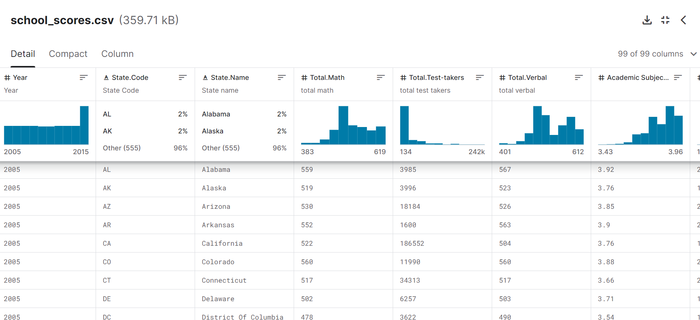
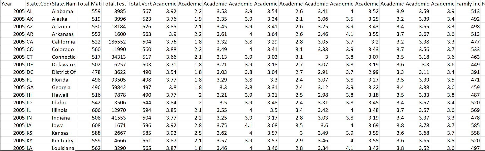
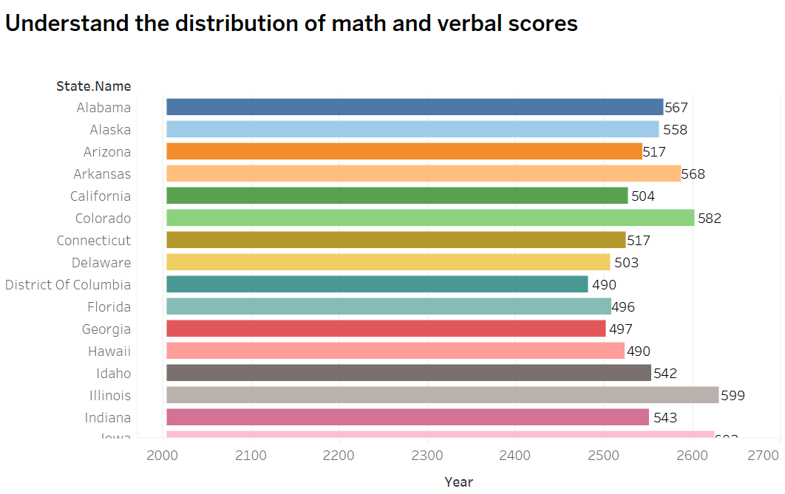
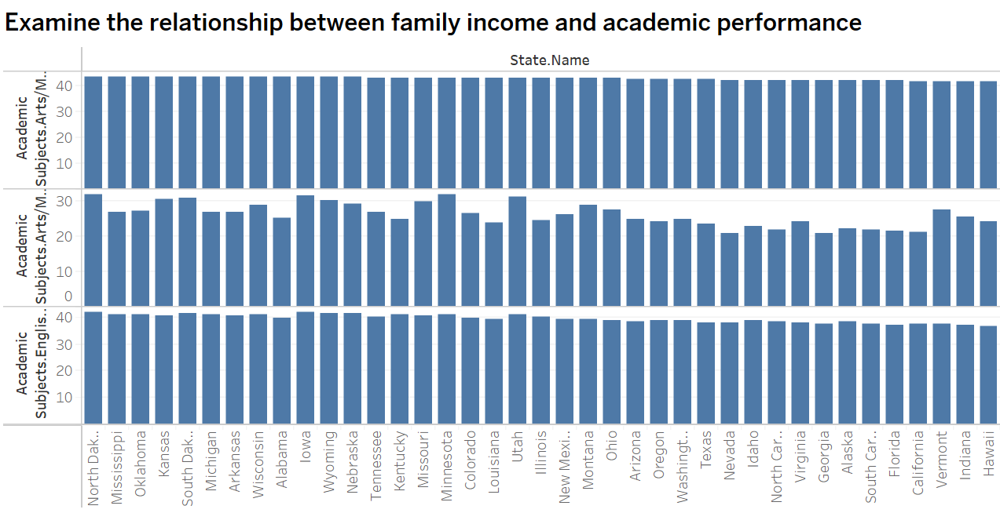
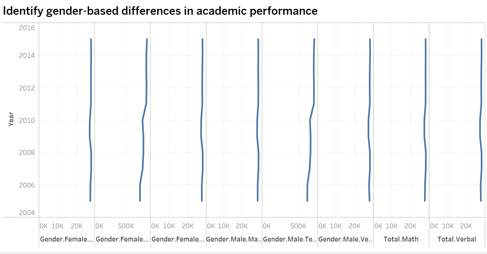
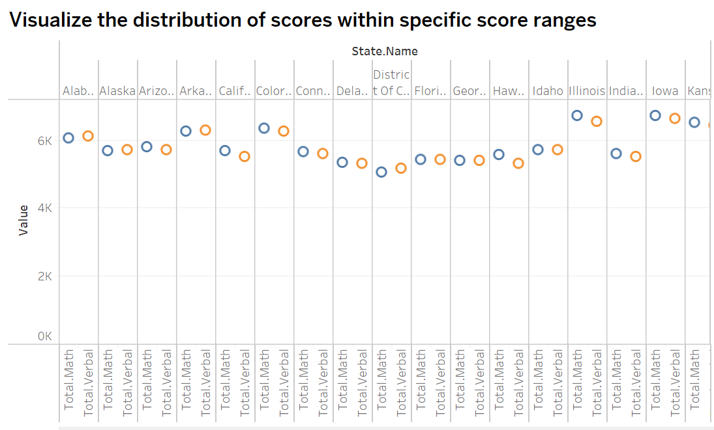
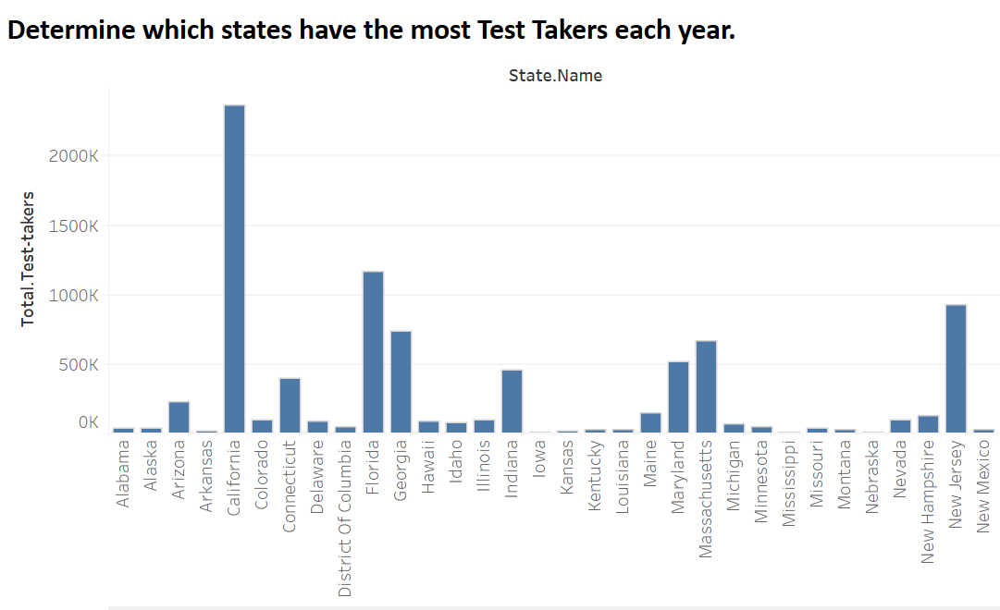
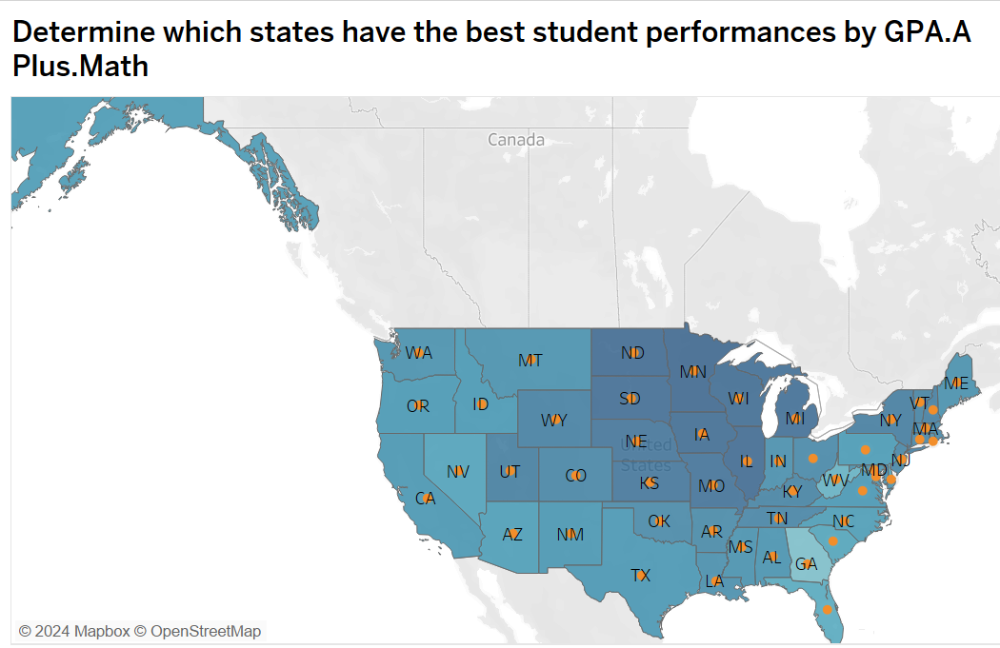
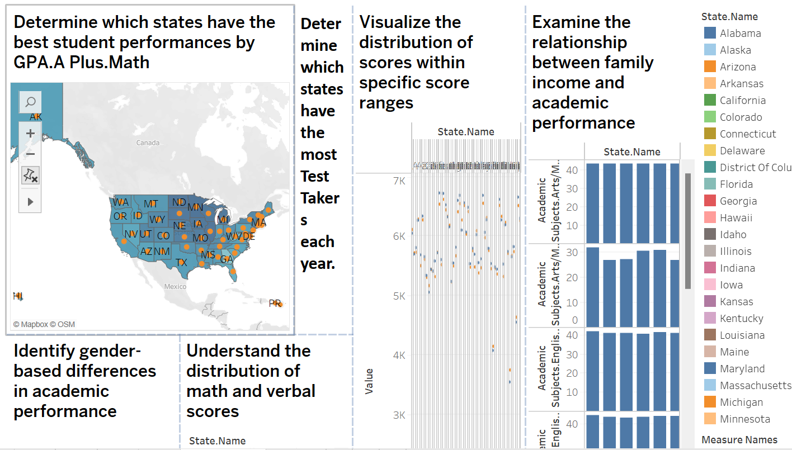
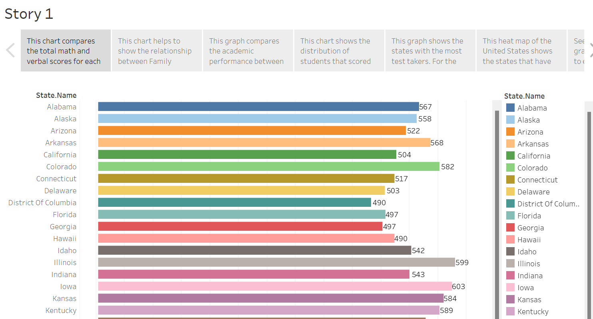

# Final_Project_Data_Visualization
## High School Student Academics in the United States
This project will explore the significance that specific demographic, geographic, psychographic, and financial factors have on a student’s academic performance by looking at data sources that show the academic performance of several students in relation to the mentioned factors.

 Author: Naiema Elsaadi
 Date: February 13, 2024
 Dr. Denise Case

## Overview

For this project, I put together a storyboard that analyzes High School student performances based on several factors. Through this analysis I looked at GPAs, Standardized Test Scores, Courses, Family Income, and States of the students and visually presented the trends in the data and mapped out the distribution of academic performances across the entire United States. From this analysis, we can determine the demographic, geographic, and academic factors that are correlated with Student Performances in academics.

## Data Sources
The dataset that is used for this project was found through Kaggle, a
popular platform for datasets. This dataset provided information on student GPAs, Standardidzed Test Scores, Family Income, State, and other Demographic and Academic information.
 <b> Source Data for csv file:</b>
https://www.kaggle.com/datasets/mexwell/us-school-scores/data

## Prerequisites

<b>Before running the project, ensure you have the following prerequisites:</b>

- Git
- Github
- Tableau 2023.1 +  installed
- Microsoft Word
- csv
- Perform the calculations and visualization using Excel or Tableau or a combination of both
-  Document the project in a final report
-  Recommended: Publish your unique, well-narrated project on Tableau Public

  ## Tableau Public

The detailed work for this project is available on Tableau Public. You can access it and view it [here](https://public.tableau.com/views/Elsaadi_Final_project/Goal6?:language=en-US&publish=yes&:display_count=n&:origin=viz_share_link).

 ## Section 1. Introduction
 This project will explore the significance that specific factors in education such as Geographics, Family Income, and Courses affect High School student perforances in their Test Scores and GPAs
 ## Section 2. Data Description
 This data source is a source that contains information about High School Students and their academic, geographic, and demographic information. This 
 includes GPA, Standardized Test Scores, State, and Family Income. This source was found on Kaggle and it is called “US School Scores”. The Excel file was 
 downloaded from this site:
 https://www.kaggle.com/datasets/mexwell/us-school-scores/data
  It has 99 columns and 578 rows.
 ## Section 3. Data Cleaning Strategies
	No cleaning was needed for this dataset.
 ## Section 4. Clean Dataset

## Section 5. Visualization Tools
I chose Tableau for each goal, because it was the visualization tool that I worked with the most and was the one I was the most comfortable with. It also had all the applications that I needed to complete my data visualization.
 ## Section 6. Visualizations and Stories
 
 
 
 
 
 
 
 
     
 ## Section 7. Conclusions 
 In conclusion, by analyzing the variables from the dataset we can come up with a stronger understanding of the factors that can predict a student’s academic performance. The main variables focused on in this data set and in this project are GPA, Courses, Family Income, Standardized Test Scores, and State for students. Seeing all these graphs and charts next to each other helps to show the relationship that each state has with academics. 
